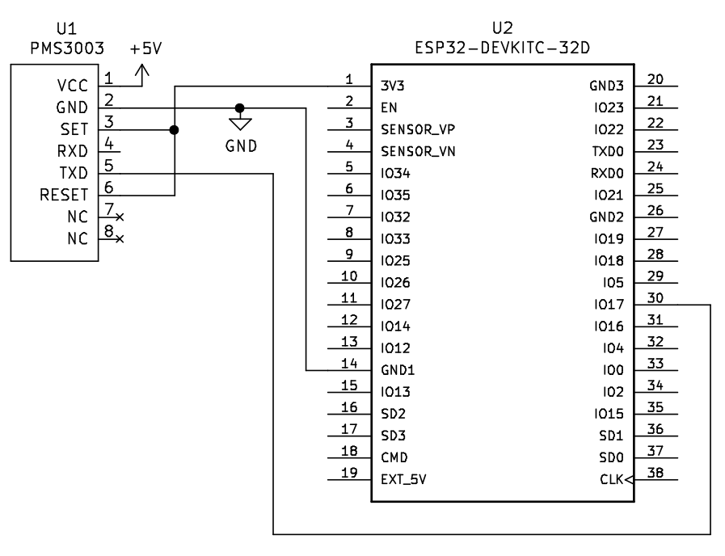
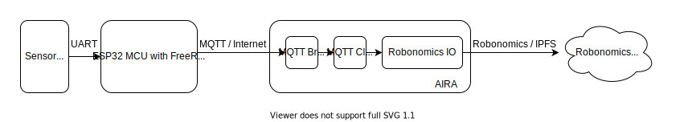
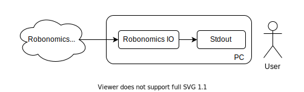

Connect an Amazon FreeRTOS device to Robonomics by MQTT
=======================================================

Here we demonstrate how a microcontroller running [Amazon's FreeRTOS](https://aws.amazon.com/freertos/) may connect to Robonomics Network by MQTT.
We use [ESP32 DevKitC](https://devices.amazonaws.com/detail/a3G0L00000AANtjUAH/ESP32-WROOM-32-DevKitC/) with FreeRTOS distribution and MQTT implementation provided by [Espressif IoT Development Framework](https://github.com/espressif/esp-idf) while Espressif is a vendor of the microcontroller used.
Also there is a [PMS-3003]() sensor for demonstration purposes.
Sensor measures presence of particulated matter in the air and one may use it to estimate air quality.
Air quality is not a topic of the article, you may find more about it at WHO's website: [Ambient (outdoor) air pollution](https://www.who.int/news-room/fact-sheets/detail/ambient-(outdoor)-air-quality-and-health).
A goal of the system is to publish sensor measurements in Airalab's Robonomics network.

Hardware setup
--------------

We connect PMS3003 TXD PIN5 to ESP32 DevKitC IO17 to transfer measurements by UART.
Also both devices require power and common ground.



Data flow
---------
In order to deliver sensor measurements to Robonomics network, on a firmware level our goal is to get data from a sensor by embedded communication protocol it supports (UART in our case) and pass it to AIRA instance by MQTT / TCP.



In our example we use AIRA cloud deployment available by public IP address and domain name assigned.
On AIRA instance we receive with [Sensors Connectivity](https://wiki.robonomics.network/docs/sensors-connectivity/).
Please check Sensors Connectivity package documentation describes how to forward data to Robonomics network in IPFS or Roboonmics on Substrate Datalog.
Here we setup output to IPFS.



Now data available in Robonomics Network and we can read it with Robonomics IO utility.

Firmware
--------

We use [ESP-MQTT sample application with TCP transport](https://github.com/espressif/esp-idf/tree/master/examples/protocols/mqtt/tcp) as a basis.
We only modify `main/app_main.c` for UART connection to the sensor, SNTP time synchronizatin and periodic MQTT publisher routine.

### Wi-Fi Configuration

In order to communicate with AIRA instance deployed in cloud, our microcontroller requires Internet connection.
We use ESP32's Wi-Fi for it.
Espressif provides utilities to configure on-board Wi-Fi.
You may find more on how to configure ESP32 development environment on your system in [Espressif's ESP-IDF Programming guide](https://docs.espressif.com/projects/esp-idf/en/latest/esp32/get-started/index.html#installation-step-by-step).
In our example we use development environment with Ubuntu 20.04 GNU/Linux.
To configure Wi-Fi we go to project folder and run SDK configuration tool.

```console
cd freertos_mqtt_robonomics_example/firmware
idf.py menuconfig
```

Then we set Wi-Fi access point SSID and password in `Example Connection Configuration` section.

TODO: menuconfig screenshot

### MQTT endpoint configuration

There are two things to configure for MQTT.
First is MQTT broker address.
It is configurable with SDK configuration tool.

```console
cd freertos_mqtt_robonomics_example/firmware
idf.py menuconfig
```

Set `Broker URL` in `Example Configuration` section.

Second thing is MQTT topic.
We set it in firmware with project name prefix followed with our ESP32 MAC address.
It gives us `/freertos_mqtt_robonomics_example/98:F4:AB:72:23:C4` for our particular microchip.

### Data format

Sensor Connectivity package requires JSON formatted data with mandatory fields.
We encode data with JSON string hard-coding geolocation values while our hardware setup contains no GNSS.
Also we use `SDS_Px` value types while it is only supported types for particulated matter values for the moment of writing.

Read data from Robonomics
-------------------------

At first let's check we receive data by MQTT.
We can subscribe to our Mosquitto MQTT broker for it.

```console
$ nix-shell -p mosquitto --run "mosquitto_sub -h localhost -t '/freertos_mqtt_robonomics_example/98:F4:AB:72:23:C4'"
{"esp32mac": "98:F4:AB:72:23:C4", "software_version": "0.1.0", "sensordatavalues": [{"value_type": "SDS_P1", "value": "4"}, {"value_type": "SDS_P2", "value": "6"}, {"value_type": "GPS_lat", "value": "1"}, {"value_type": "GPS_lon", "value": "1"}]}
```

We got our JSON string means AIRA receives data by MQTT correctly.

Now let's check `Sensors Connectivity` package running.

TODO: how to check it?

Lastly let's check forwarding works corretcly and we can subscribe to data with Robonomics Datalog.

TODO

nix-shell -p mosquitto --run "mosquitto_sub -h localhost -t '/freertos_mqtt_robonomics_example/PMS3003-98:F4:AB:72:23:C4' | robonomics io write pubsub '/freertos_mqtt_robonomics_example/PMS3003-98:F4:AB:72:23:C4'"
robonomics io read pubsub '/freertos_mqtt_robonomics_example/PMS3003-98:F4:AB:72:23:C4'

Conclusion
----------

Original resources used
-----------------------
* ESP32 DevKitC pinout from GoJimmy's blog https://gojimmypi.blogspot.com/2017/03/jtag-debugging-for-esp32.html
* PSM3003 data structure and decoder from OpenAirProject https://github.com/openairproject/sensor-esp32
Thank you all!
